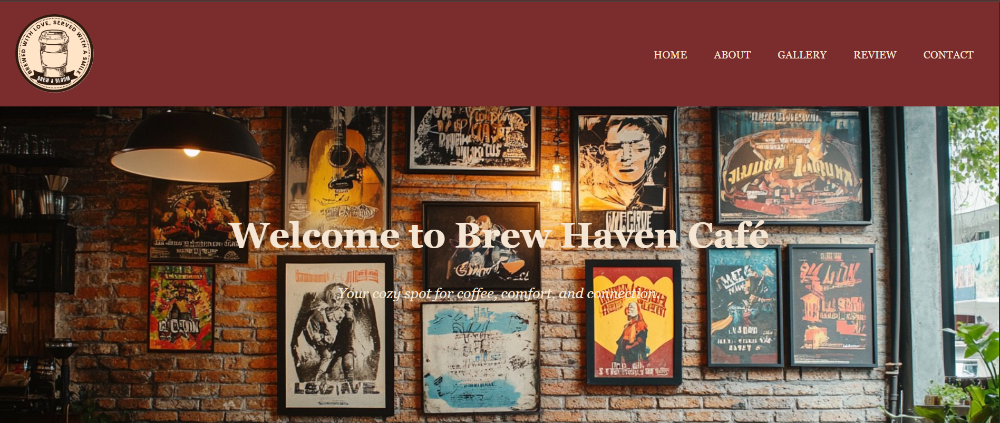
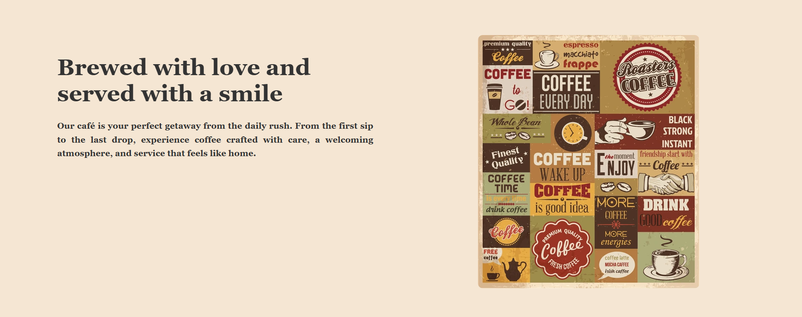
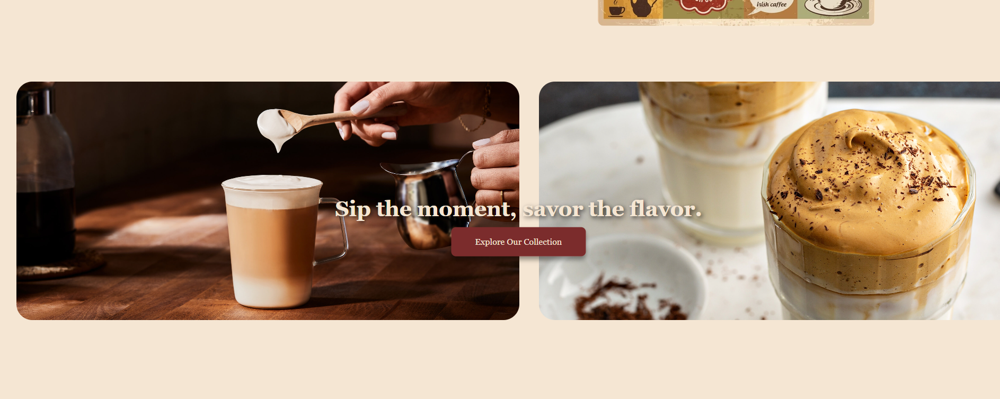
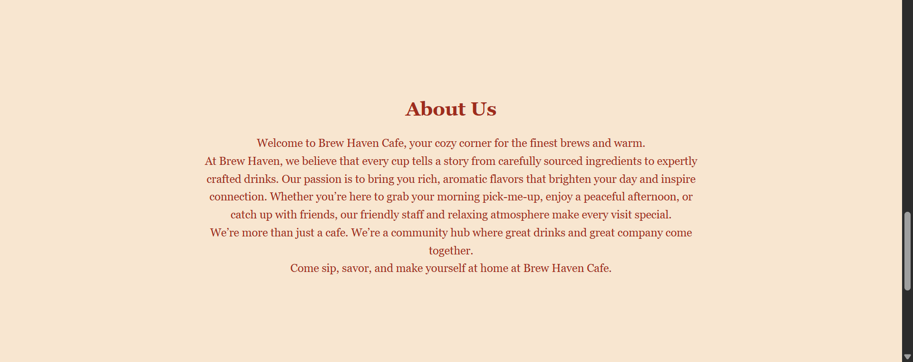
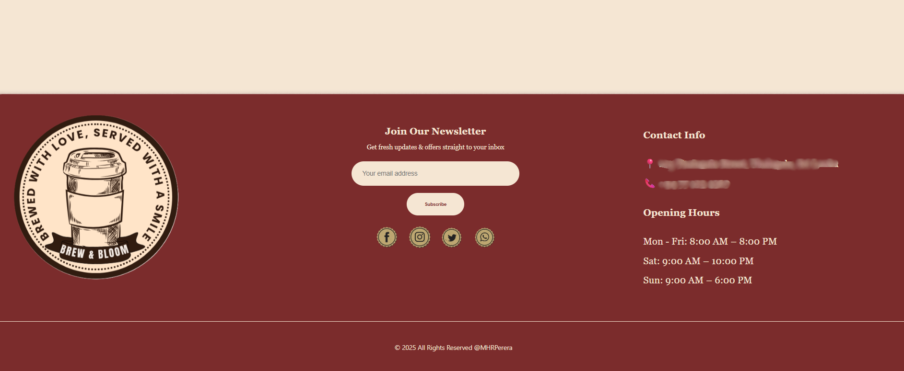
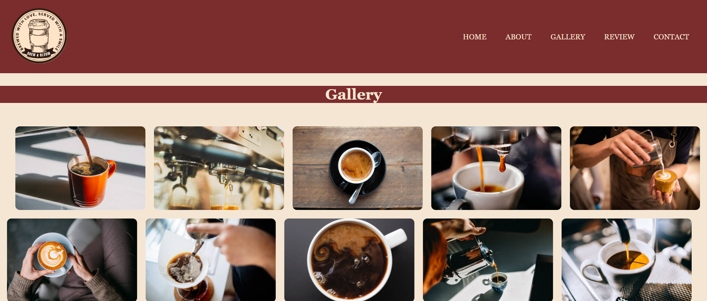
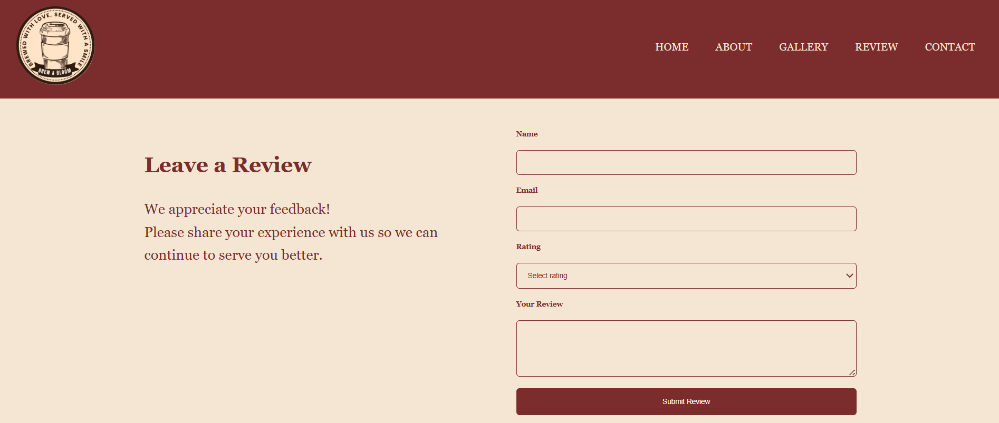

# Fictional Café Website

This is a personal practice project to enhance my UI/UX and front-end development skills.  
The website is fully responsive and user-friendly, designed for a fictional café.

## Features
- Smooth navigation  
- Image slider on the homepage  
- Structured sections: About, Gallery, Reviews, Contact  

## Screenshot Preview

Homepage slider example:  

Gallery preview:  

Reviews section example:  

Contact page preview:  

## Technologies Used
- HTML  
- CSS  
- JavaScript  

## Future Plans
- Backend integration for dynamic content and user interaction  

---

This project helped me strengthen my front-end skills and understanding of responsive design principles.
